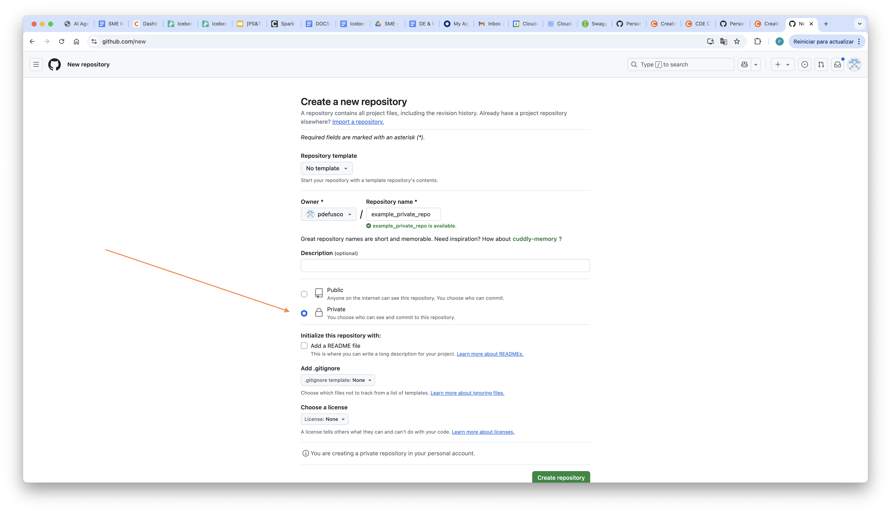
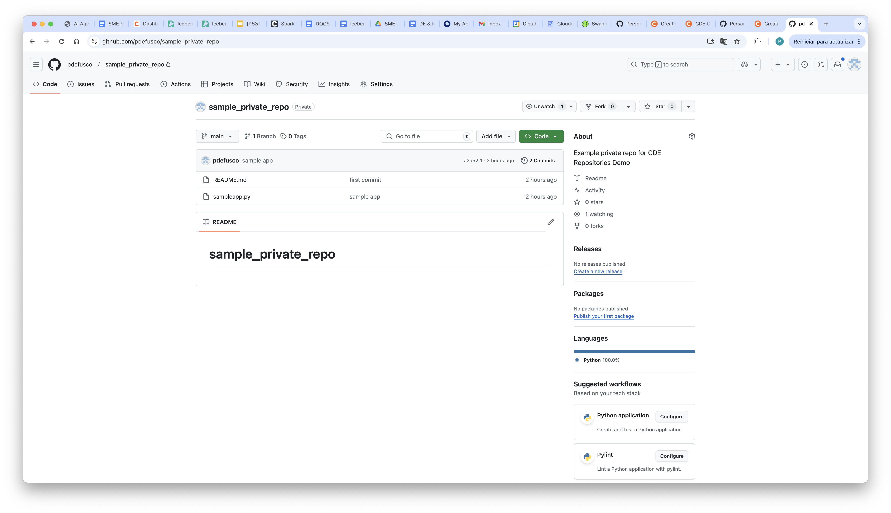
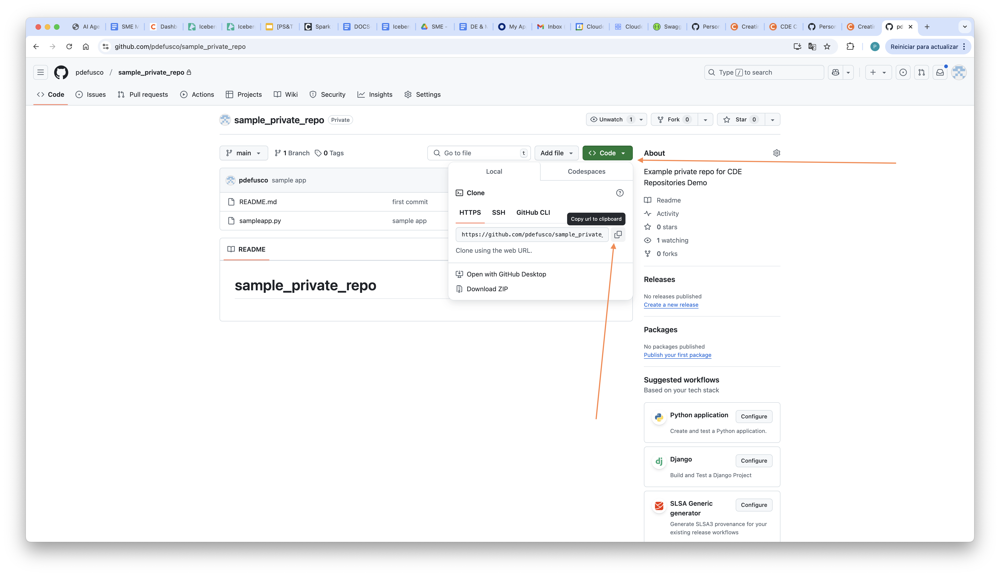
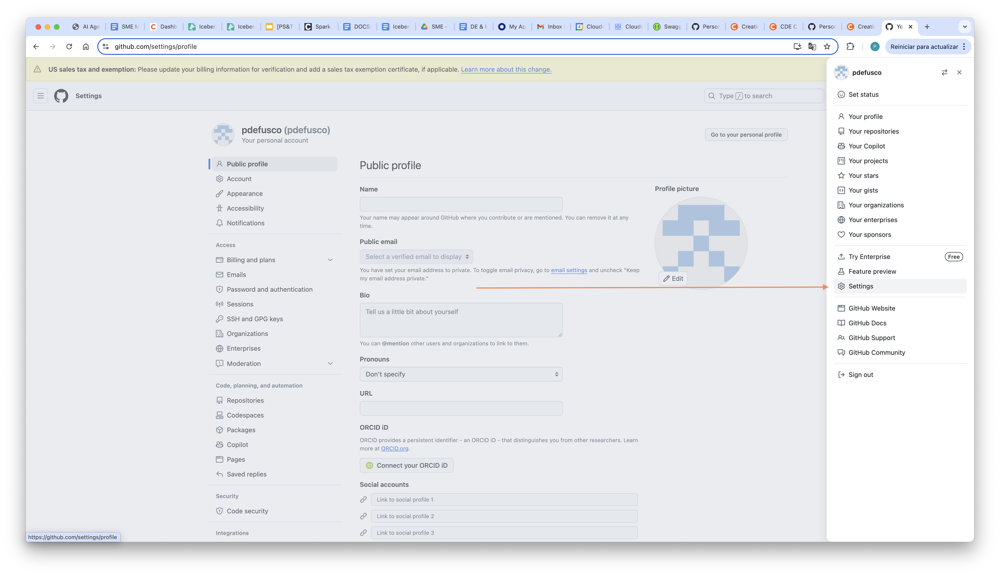
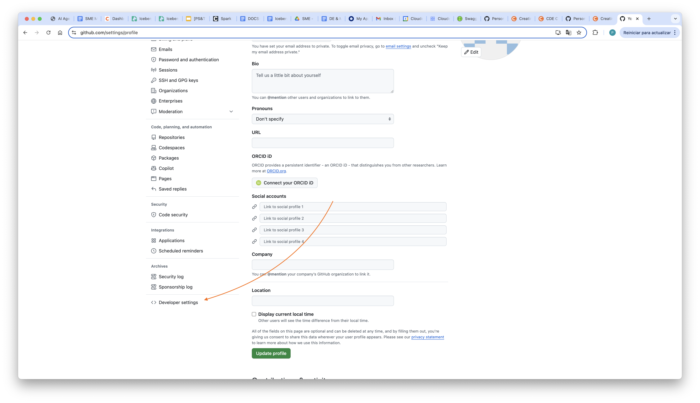
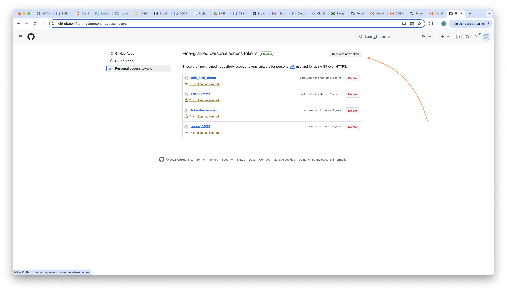
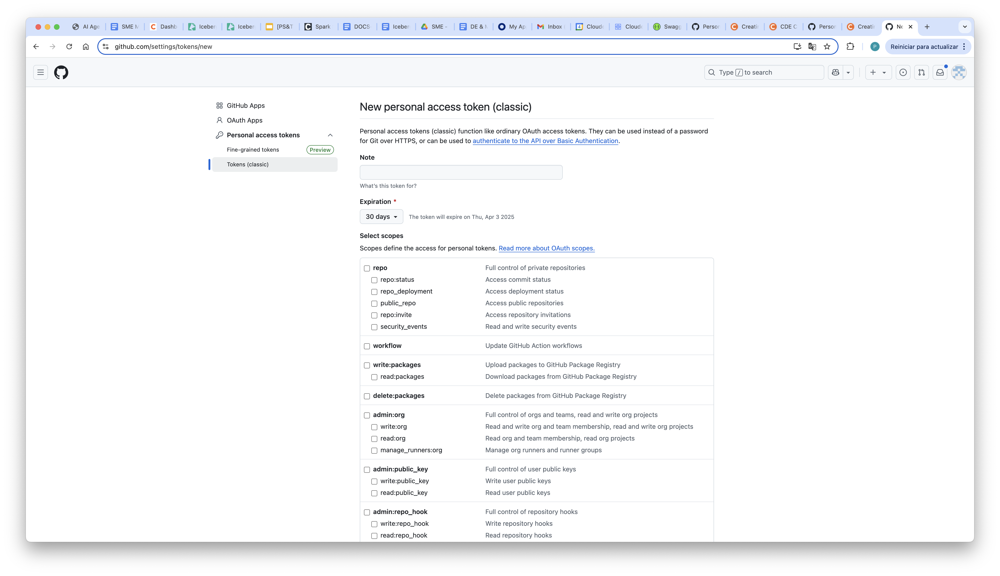
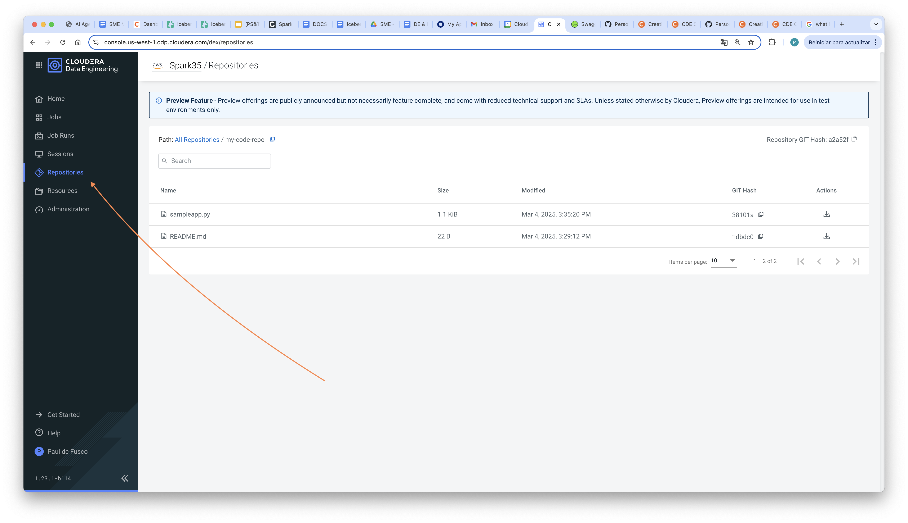

## CREATING A CDE REPOSITORY WITH A PRIVATE GIT REPOSITORY

#### OBJECTIVE

In this article you will learn how to create a CDE Repository by cloning a private Git repository with the help of CDE Credentials.

Cloudera Data Engineering (CDE) is a cloud-based service that helps businesses build, manage, and scale data pipelines. It's built on Apache Spark and integrates with other Cloudera services.

Git repositories allow teams to collaborate, manage project artifacts, and promote applications from lower to higher environments. CDE Repositories can be used to clone git repositories into a Virtual Cluster in order to make the imported files available to CDE Jobs as reusable dependencies. CDE currently supports Git providers such as GitHub, GitLab, and Bitbucket.

CDE Credentials allow you to store secrets such as usernames, passwords, and tokens, in secure, reusable objects that can be associated with CDE Jobs, Custom Runtimes and Repositories.

#### REQUIREMENTS

This example was built with CDE 1.23. A CDE Service, Virtual Cluster, a Private Git repository, and a local installation of the CDE CLI are required to reproduce the commands in your environment.

#### CREATE PRIVATE GITHUB REPOSITORY

Log in your GitHub account and create a private GitHub repository. Save the repository's URL, for example:

```
https://github.com/pdefusco/sample_private_repo.git
```







#### CREATE GITHUB TOKEN

In the Developer Settings, create a new Classic Token.









Keep the token handy.

#### CREATE CDE CREDENTIALS

Using the CDE CLI, create a Basic CDE Credential using Git username and token.

In the following command, assign an arbitrary credential name and apply your git username as the username parameter.

```
% cde credential create \
  --name my-git-creds \
  --type basic \
  --username pdefusco
```

You will now be prompted to enter your password, twice. Paste the token you obtained earlier in the GitHub settings.

```
Enter password for username "pdefusco":
Retype password for username "pdefusco":
```

Validate credentials. Here is a sample output:

```
% cde credential list
[
  {
    "name": "my-git-creds",
    "type": "basic",
    "created": "2025-03-05T00:03:28Z",
    "modified": "2025-03-05T00:03:28Z"
  },
  {
    "name": "paul-git-creds",
    "type": "basic",
    "created": "2025-03-05T00:12:58Z",
    "modified": "2025-03-05T00:12:58Z"
  },
  {
    "name": "test-git-creds",
    "type": "workload-credential",
    "created": "2025-03-04T23:56:17Z",
    "modified": "2025-03-04T23:56:17Z"
  }
]
```

#### CREATE CDE REPOSITORY USING PRIVATE GIT CREDENTIALS

You will now use the CLI to create a CDE repository. This will be a clone of your private git repository.

Update the name, credential, url, and branch parameters. Then run this CLI command:

```
% cde repository create \                                                      
--name my-test-repo \
--credential my-git-creds \
--url https://github.com/pdefusco/sample_private_repo.git \
--branch main
```

Validate the repository via the CLI:

```
% cde repository list
[
  {
    "name": "my-code-repo",
    "type": "git",
    "status": "ready",
    "signature": "a2a52f11546ef9d4039b4fd01f504bdd8b498c35",
    "created": "2025-03-05T01:08:08Z",
    "modified": "2025-03-05T01:08:08Z",
    "retentionPolicy": "keep_indefinitely",
    "git": {
      "repository": "https://github.com/pdefusco/sample_private_repo.git",
      "branch": "main",
      "credential": "my-git-creds"
    }
  }
]
```

Validate the repository in the UI:



## Summary

Cloudera Data Engineering (CDE) provides a command line interface (CLI) client. You can use the CLI to create and update jobs, view job details, manage job resources, run jobs, and so on. In this article, you learned how to use the CLI to create reusable CDE credentials for integrating with GitHub, and generated a CDE Repository to import application code from a private GitHub repository.

## References

* [CDE Repositories Documentation](https://docs.cloudera.com/data-engineering/1.5.4/manage-jobs/topics/cde-git-repo.html)
* [GitHub Documentation](https://docs.github.com/en)
* [CDE Documentation](https://docs.cloudera.com/data-engineering/cloud/index.html)
* [How to Manage CDE Repositories in CDEPY](https://community.cloudera.com/t5/Community-Articles/How-to-manage-CDE-Repositories-with-CDEPY/ta-p/388605)
* [CDE CLI Reference](https://docs.cloudera.com/data-engineering/cloud/cli-access/topics/cde-cli-reference.html)
